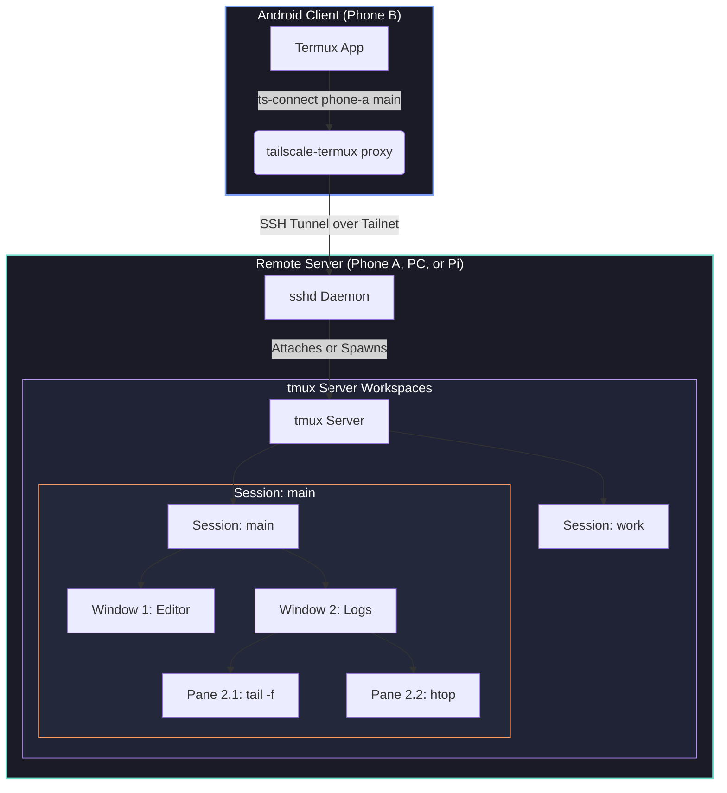

# 🖥️ tmux — The Complete Newbie Guide (Tailscale-Termux Edition)

Welcome! If you are using **tailscale-termux**, you are already using `tmux` behind the scenes. 

In Termux on Android, background processes are aggressively killed by the operating system (due to the Android Phantom Process Killer and OOM manager). **tmux** is the magic shield that keeps your shell sessions, scripts, and editors running on the server even when your phone disconnects, switches networks, or kills the Termux application.

---

## 🗺️ Visual Architecture: How it fits together

Here is how `tailscale-termux` uses `tmux` to provide persistent terminal workspaces over a secure WireGuard mesh:



---

## 🧠 Core tmux Concepts

Think of tmux as a hierarchy of nesting boxes:

1. **Server**: The background process running on the host. It manages all your active workspaces. If your terminal emulator or SSH connection closes, the tmux server keeps running.
2. **Session**: A collection of windows representing a specific project or context (e.g., "frontend", "backend", "system-admin"). You can detach from a session and attach to it later.
3. **Window**: A single full-screen view inside a session, analogous to a tab in a web browser. Each window has a number (starting at 1) and a name.
4. **Pane**: A subdivision of a window. You can split a window vertically or horizontally into multiple panes to view several terminals simultaneously.

| Concept | Browser Analogy | Purpose in tailscale-termux |
|---|---|---|
| **Session** | Browser Profile / Window | Separate project environment (survives network disconnects) |
| **Window** | Browser Tab | Separate workspace task (e.g., Tab 1 for Code, Tab 2 for Server Logs) |
| **Pane** | Split Screen | Concurrent shell views in a single tab (e.g., run code on left, monitor CPU on right) |

---

## ⌨️ The Prefix Key & Termux Keyboards

Almost every interaction in tmux begins with a special keyboard shortcut sequence called the **Prefix Key**. By default, it is:

> **`Ctrl + b`**

### How to use it:
1. Press and hold **`Ctrl`**, then tap **`b`**.
2. **Release both keys completely.** (You are now in "command mode").
3. Press the command shortcut key (for example, **`%`** for a vertical split).

### 📱 Keyboard Tips for Android / Termux:
- **No Ctrl Key?** Termux provides an extra keys bar at the top of your software keyboard containing `Ctrl`, `Alt`, `Tab`, and arrow keys. Tap the `Ctrl` button on that bar, then tap `b` on your keyboard.
- **Volume Key Shortcut:** In Termux, you can use the physical **`Volume Down`** button on your phone as the `Ctrl` key. So pressing `Volume Down + B` functions exactly like `Ctrl + b`.
- **Special Keyboards:** For heavy command-line work, installing an app like **Hacker's Keyboard** (from F-Droid or Play Store) provides a full desktop layout on your screen.

---

## 🚀 Step-by-Step Walkthrough: Your First tmux Session

Let's practice creating, splitting, and detaching from a session.

### 1. Start a named session
On your remote server (or locally in Termux to test):
```bash
tmux new -s newbie
```
*Note the green/white status bar that appears at the bottom. This means you are inside tmux! The left side `[newbie]` shows your session name.*

### 2. Split the screen (Panes)
Let's split our single terminal into two side-by-side:
* Press `Ctrl + b`, release, then press `%` (Shift + 5). You now have two vertical panes.
* Press `Ctrl + b`, release, then press `"` (Shift + '). The active pane splits horizontally.

### 3. Navigate between panes
To switch focus between the split screens:
* Press `Ctrl + b`, release, then press any **Arrow Key** (`←` `↑` `↓` `→`) to move the cursor to the pane in that direction.

### 4. Create a new window (Tab)
Need a clean full-screen tab?
* Press `Ctrl + b`, release, then press `c`. 
* Look at the status bar. You will see `1:bash` and `2:bash*`. The asterisk `*` indicates the active window.
* To switch back to window 1: Press `Ctrl + b`, release, then press `1`.

### 5. Detach (The Superpower)
Now, let's leave tmux running in the background and return to the main Termux shell:
* Press `Ctrl + b`, release, then press `d`.
* *Output: `[detached (from session newbie)]`*
* You are now back in your normal terminal. Anything running inside that session is still active!

### 6. Reattach
To jump back into your running session:
```bash
tmux attach -t newbie
```
*You are back! All your splits and commands are exactly as you left them.*

---

## 🗂️ The tailscale-termux tmux Commands

`tailscale-termux` provides wrappers that automate tmux session management over SSH. You don't need to manually run `ssh` and then `tmux`. Use these commands on your **Client** device:

### 1. Connect and Attach: `ts-connect`
```bash
# Start an interactive menu to choose a server and attach to or create a session
ts-connect

# Connect to a specific server (e.g. phone-a) and prompt for a session
ts-connect phone-a

# Connect directly to a specific named session (creates it if it doesn't exist)
ts-connect phone-a coding

# Force-create a brand new session named 'server-logs'
ts-connect phone-a --new server-logs

# Bypass tmux entirely and open a plain SSH session
ts-connect phone-a --plain
```

### 2. View Sessions Remotely: `ts-sessions`
You can query and manage your remote sessions without logging into the server:
```bash
# List all active tmux sessions across ALL registered servers
ts-sessions all

# List sessions specifically on 'phone-a'
ts-sessions phone-a

# Terminate/kill the session named 'newbie' running on 'phone-a' remotely
ts-sessions phone-a kill newbie
```

---

## 📋 Keyboard Shortcut Reference Cheat Sheet

Remember to press **`Ctrl + b`** (and release) before any of these keys:

### 🎛️ Session Operations
| Keys | Action | Description |
| :---: | :--- | :--- |
| `d` | **Detach** | Keep session running and return to normal shell |
| `s` | **Interactive Switcher** | Opens a list of all active sessions to switch between |
| `$` | **Rename Session** | Change the name of the current session |
| `:new` | **New Session** | (Type after prefix) Create a new session on the fly |

### 🪟 Window (Tab) Operations
| Keys | Action | Description |
| :---: | :--- | :--- |
| `c` | **Create Window** | Spawn a new window tab |
| `,` | **Rename Window** | Rename the current tab (e.g., rename it to "editor" or "logs") |
| `n` | **Next Window** | Move to the next tab |
| `p` | **Previous Window** | Move to the previous tab |
| `0`–`9` | **Go to Tab #** | Jump directly to window by its number index |
| `w` | **Interactive List** | Choose a window/pane visually from a list |
| `&` | **Kill Window** | Close the active window (requires confirmation) |

### ▪️ Pane (Split) Operations
| Keys | Action | Description |
| :---: | :--- | :--- |
| `%` | **Vertical Split** | Split current pane side-by-side |
| `"` | **Horizontal Split** | Split current pane top-and-bottom |
| `←` `↑` `↓` `→` | **Navigate** | Move focus to pane in arrow direction |
| `z` | **Toggle Zoom** | Maximize current pane to full screen (press again to restore split!) |
| `x` | **Close Pane** | Kill current pane (prompts for confirmation) |
| `q` | **Show Numbers** | Briefly displays pane numbers; press number to jump |
| `!` | **Break Out** | Turn the current pane into its own separate window tab |
| `Ctrl + Arrow` | **Resize Pane** | Hold Ctrl and press arrows to resize borders (step-by-step) |
| `Spacebar` | **Cycle Presets** | Cycle through predefined layout presets (equal splits, columns, etc.) |

---

## 📜 Copy Mode & Scrolling (Solving the biggest Newbie Trap)

When you run a command in tmux and try to scroll up using your normal terminal scrollbar, it won't work. Instead, it will scroll your terminal application's buffer. To navigate your output history, you must enter tmux **Copy Mode**.

### Step-by-Step Copy/Scroll Guide:
1. **Enter Copy Mode:** Press `Ctrl + b` then `[` (square bracket).
   * *Look at the top-right corner. You will see a line indicator (e.g. `[0/0]`), indicating you are in copy mode.*
2. **Scroll:** Use the **Arrow Keys**, **PageUp/PageDown**, or swipe up/down with your finger (if Mouse Mode is enabled).
3. **Select and Copy Text:**
   * **In standard mode:** Hold `Shift` on your keyboard and drag your mouse/finger across the text to copy using your terminal emulator's native selection.
   * **In Vim mode (pre-configured in tailscale-termux):**
     * Move your cursor to the start of the text.
     * Press `Spacebar` to start selecting.
     * Move the cursor to the end of the text.
     * Press `Enter` (or `y`) to copy to tmux buffer.
4. **Paste copied text:** Press `Ctrl + b` then `]` (close square bracket).
5. **Exit Copy Mode:** Press `q` to return to your normal prompt.

---

## 🖱️ Mouse Mode in Termux

By default, the `tailscale-termux` setup script enables **Mouse Mode** on the server. Because Termux supports touch gestures as mouse clicks, you can use your phone's touchscreen directly!

- **Select Panes:** Tap anywhere inside a pane to focus on it.
- **Scroll Output:** Swipe up or down inside a pane to automatically enter copy mode and scroll through logs.
- **Resize Borders:** Tap and drag the dividing line between panes to adjust their sizes.

> [!NOTE]
> If you need to copy text using your phone's system clipboard (to paste into Chrome, WhatsApp, etc.) while Mouse Mode is on, press and hold the **`Shift`** key (or tap `ALT` on the Termux keys bar) while selecting text with your finger.

---

## 🛠️ Customize Your tmux Configuration

tmux reads its settings from a file located at `~/.tmux.conf` on your home directory.

The `tailscale_server_setup.sh` script automatically configures a clean, user-friendly config. You can view or edit it using:
```bash
nano ~/.tmux.conf
```

### Pre-Configured settings in `tailscale-termux`:
- `set -g mouse on` — Enables the touch/mouse controls detailed above.
- `set -g history-limit 10000` — Increases scroll buffer to 10,000 lines.
- `setw -g aggressive-resize on` — If you attach to the same session from a small phone and a large monitor, tmux resizes windows to fit the active screen rather than defaulting to the smallest client.
- `set -g renumber-windows on` — If you have windows 1, 2, 3, and you close window 2, window 3 automatically becomes window 2 so you don't have gaps.

### 💡 Popular Customizations to Add:
If you want to customize your config further, paste these lines into `~/.tmux.conf`:

```tmux
# 1. Remap Prefix from Ctrl+b to Ctrl+a (easier to reach)
unbind C-b
set-option -g prefix C-a
bind-key C-a send-prefix

# 2. More intuitive split keybinds (instead of % and ")
bind | split-window -h -c "#{pane_current_path}"
bind - split-window -v -c "#{pane_current_path}"

# 3. Easy configuration reload
bind r source-file ~/.tmux.conf \; display "tmux config reloaded!"
```
*After adding these, press `Ctrl + b` then `:` and type `source-file ~/.tmux.conf` (or press `Ctrl+b r` if you added the shortcut) to apply changes immediately.*

---

## 🆘 Troubleshooting & FAQ

### Q1: I am inside a tmux session and my SSH connection died. How do I get back?
Simply run `ts-connect` again! Select the same server, and pick the session you were working in from the list. Everything will be exactly where you left off.

### Q2: I connected from a phone and a laptop. Why is my window screen area tiny?
If a smaller screen (like a phone) is currently viewing the session, tmux will scale the window down to fit that screen, creating a border of dots `...` around the terminal for the laptop client.
- **Solution:** Detach the other device using `Ctrl + b` then `d`, or run `tmux detach-client -a` inside the session to detach all other active viewports.

### Q3: How do I close a pane or window if it gets stuck?
- If the terminal is responsive, type `exit` or press `Ctrl + d`.
- If a program is hanging, press `Ctrl + b` then `x` to kill the active pane, or `Ctrl + b` then `&` to kill the entire window.

### Q4: I ran `tmux` inside another `tmux` session. Now my prefix key controls the outer one!
If you nested a session (e.g. you are on your laptop in tmux, and you SSH into Termux and start tmux), press your prefix twice:
- `Ctrl + b` then `Ctrl + b` will send the prefix key command to the **inner** nested tmux session.

---

*Happy multiplexing! 🚀*
